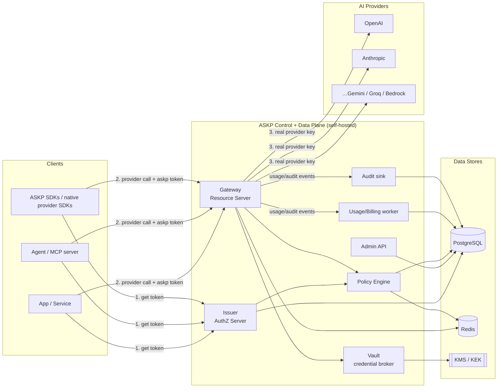
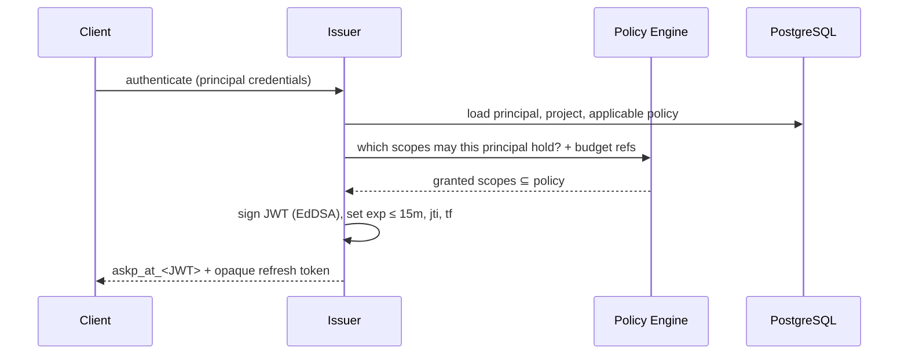
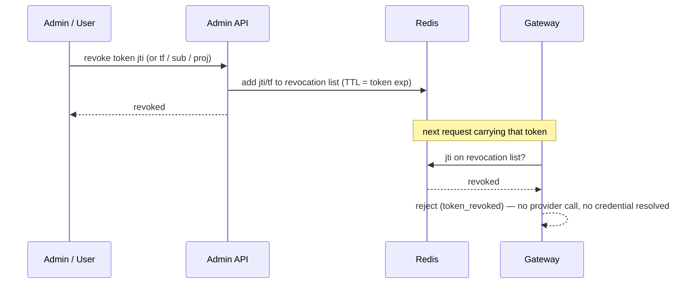

# ASKP — System Architecture

**Status:** Draft · **Audience:** Engineers, operators, contributors
**Scope:** High-level system architecture for the `askp/v1` reference implementation. Component
internals, microservice boundaries, and deployment topology are expanded in later batches; this
document establishes the shape everything else fits into.

---

## 1. Architectural goals

The architecture is shaped directly by the locked decisions ([`docs/README.md`](../README.md))
and the protocol invariants ([`spec/askp-protocol-v1.md` §3.2](../../spec/askp-protocol-v1.md)):

| Goal | Driven by |
|---|---|
| Provider credentials never leave the trust boundary | INV-1 |
| Pre-flight policy/budget enforcement on the hot path | INV-2, INV-3 |
| Strict tenant isolation | INV-4 |
| Instant revocation without redeploys | INV-5 |
| Complete attribution & audit | INV-6 |
| Stateless, horizontally scalable hot path | Token model (hybrid JWT) |
| Self-hosted, Docker/K8s-native, cloud-portable | Hosting decision |
| Drop-in for existing provider SDKs | Passthrough decision |

## 2. Logical components

ASKP is composed of a small set of services around shared data stores. Each maps to a protocol
role (spec §2.1).

| Component | Protocol role | Responsibility | On hot path? |
|---|---|---|---|
| **Issuer** | Authorization Server | Authenticate principals, evaluate policy at issuance, mint Access + Refresh Tokens, manage signing keys (JWKS). | No (issuance only) |
| **Gateway** | Resource Server | Validate tokens, run the §6.3 pipeline, resolve credentials in-boundary, proxy to providers, emit usage/audit. | **Yes** |
| **Vault** | Vault | Encrypt/store/rotate Provider Credentials; release plaintext only in-boundary. | Yes (credential resolve) |
| **Policy Engine** | (shared library/service) | Evaluate scopes, policies, budgets, and rate limits for Issuer and Gateway. | Yes |
| **Admin API** | — | CRUD for orgs, projects, users, agents, provider accounts, policies, budgets; revocation. | No |
| **Usage/Billing worker** | — | Aggregate Usage Records, compute cost, update budget counters. | No (async) |
| **Audit sink** | — | Persist append-only audit events. | No (async) |

> The Policy Engine is drawn as a distinct component for clarity. In the reference
> implementation it MAY ship as a shared library embedded in the Issuer and Gateway (to keep
> the hot path in-process) while remaining logically separable. The microservice-vs-modular
> boundary decision is finalized in Batch 3.

## 3. Data stores

| Store | Holds | Why |
|---|---|---|
| **PostgreSQL** | Orgs, projects, users, agents, provider accounts, **encrypted** credentials, policies, budgets, usage records, audit log. | Durable system of record; relational integrity; tenant-scoped rows. |
| **Redis** | Revocation list (`jti`/`tf`), rate-limit counters, budget counters/cache, short-lived session state. | Microsecond hot-path lookups for revocation, limits, and budget checks. |
| **KMS / KEK provider** *(pluggable)* | The key-encryption-key that wraps data-encryption keys for credentials. | Envelope encryption; operator controls the root of trust (env / cloud KMS / external Vault backend). |
| **Object store / log pipeline** *(optional)* | Long-term audit & usage export. | Tamper-evident retention, analytics, SIEM integration. |

## 4. High-level architecture



**Two planes:**
- **Control plane** — Admin API + Issuer + Policy Engine + Vault writes: low-volume,
  configuration and issuance.
- **Data plane** — Gateway: high-volume, latency-sensitive, horizontally scaled, stateless
  except for Redis/Vault lookups.

## 5. Trust boundaries

```mermaid
flowchart TB
    subgraph Untrusted["Client zone (untrusted)"]
        C[App / Agent\nholds ASKP token only]
    end
    subgraph Boundary["ASKP trust boundary"]
        G[Gateway]
        V[Vault]
        plaintext[(decrypted provider key\nexists only here, only momentarily)]
    end
    subgraph Prov["Provider zone"]
        P[Provider API]
    end

    C -->|ASKP token\n(scoped, short-lived)| G
    G --> V
    V --> plaintext
    plaintext -->|real key over TLS| P
```

- Clients hold **only** ASKP tokens — never a Provider Credential (INV-1).
- The plaintext Provider Credential exists **only** inside the boundary, **only** at the moment
  of forwarding, and is never logged or returned.
- The operator owns the boundary and the KEK. ASKP is designed assuming **operator ≠ protocol
  author** — a self-hosted deployment trusts no third party with its keys.

## 6. Core request flows

### 6.1 Token issuance



### 6.2 Provider call (the hot path)

```mermaid
sequenceDiagram
    participant C as Client
    participant GW as Gateway
    participant R as Redis
    participant POL as Policy Engine
    participant V as Vault
    participant P as Provider

    C->>GW: POST /v1/providers/openai/v1/chat/completions  (Bearer askp_at_…)
    GW->>GW: verify JWS, exp, iss, aud
    GW->>R: jti / tf on revocation list?
    R-->>GW: not revoked
    GW->>GW: derive (provider, model, capability); match scope (default deny)
    GW->>POL: policy still permits? rate limit ok?
    POL->>R: incr + check rate/budget counters
    POL-->>GW: allow
    GW->>V: resolve provider credential for org (in-boundary)
    V-->>GW: plaintext key (envelope-decrypted)
    GW->>P: proxy request with real key (stream if applicable)
    P-->>GW: response / SSE stream
    GW-->>C: response proxied back
    GW--)R: account realized cost to budget
    GW--)GW: emit Usage Record + Audit Log (async)
```

### 6.3 Instant revocation



No Provider Credential is rotated; no Client is redeployed. Effective on the next request (INV-5).

## 7. Why the hot path stays fast

- **Token validation is local.** The Gateway verifies the JWT signature with the Issuer's
  public key (cached JWKS) — no DB round-trip for authentication.
- **The only per-request network lookups are Redis** (revocation + counters) and, on allow,
  the **Vault** credential resolve (which itself caches envelope-decrypted material in-boundary
  with a short TTL, never returning it to clients).
- **Policy decisions are pre-computed where possible.** The token already carries granted
  scopes; the Gateway re-checks against current policy but the common case is a fast in-memory
  match plus a Redis counter check.
- **Usage and audit are emitted asynchronously**, off the response path, so recording never
  adds latency to the proxied call (while MUST-not-drop guarantees are kept via a durable queue).

## 8. Scalability & failure posture

| Concern | Approach |
|---|---|
| **Throughput** | Gateway is stateless → scale horizontally behind a load balancer. Redis and Postgres scale independently. |
| **Issuer load** | Issuance is low-volume vs. inference calls; Issuer scales separately from Gateway. |
| **Redis unavailable** | Fail **closed** on revocation/budget by default (configurable). Short token TTL bounds risk; an operator MAY choose fail-open for rate limits only, never for revocation. |
| **Vault/KMS unavailable** | Requests fail with `provider_unavailable`; no plaintext fallback. |
| **Provider outage** | Surfaced as `provider_error`/`provider_unavailable`; ASKP does not mask provider failures in `v1` (no fallback routing). |
| **Postgres failover** | Standard HA Postgres; hot path tolerates brief blips because auth is signature-based and counters live in Redis. |

## 9. Observability

ASKP is observable by design (a stated NFR). Across components:

- **Metrics (Prometheus):** request rate/latency per provider/model, auth failures by reason,
  revocation hits, budget rejections, rate-limit rejections, provider upstream latency, cost/min.
- **Traces (OpenTelemetry):** a span per request across Gateway → Policy → Vault → Provider,
  carrying `request_id`, `org`, `proj`, `jti` (never the token itself).
- **Logs (structured):** one structured event per request with attribution and decision
  outcome; **never** Provider Credentials or full tokens (spec §9 S-6).
- **Dashboards (Grafana):** per-org/project spend, top models, denial reasons, latency SLOs.

## 10. Technology mapping

| Concern | Choice |
|---|---|
| Language / framework | Python · FastAPI (async) |
| Data modeling / ORM | SQLModel · Pydantic v2 |
| Database | PostgreSQL |
| Cache / hot-path state | Redis |
| Outbound HTTP to providers | httpx (async, streaming) |
| Background jobs | ARQ or Celery (usage aggregation, exports) |
| Tokens | JWT (JWS, EdDSA/RS256) |
| Migrations | Alembic |
| Containerization | Docker; Kubernetes-ready |
| Observability | Prometheus · Grafana · OpenTelemetry |
| Testing | Pytest |

## 11. What this document deliberately defers

To keep Batch 1 coherent, the following are named but specified later:

- **Component-internal architecture** and the **microservice vs. modular-monolith** boundary → Batch 3.
- **Physical database schema & ER diagram** → Batch 3.
- **Encryption scheme details** (envelope encryption, key rotation mechanics) → Batch 2 (Security Model).
- **Deployment topology, Docker Compose, Helm/K8s** → Batch 4.
- **Provider Adapter contract** (how a new provider is added) → Batch 4.

---

*Batch 1 complete. Next batch: Security Model, Threat Model, Token Structure, Permission Model, Scope Design.*
