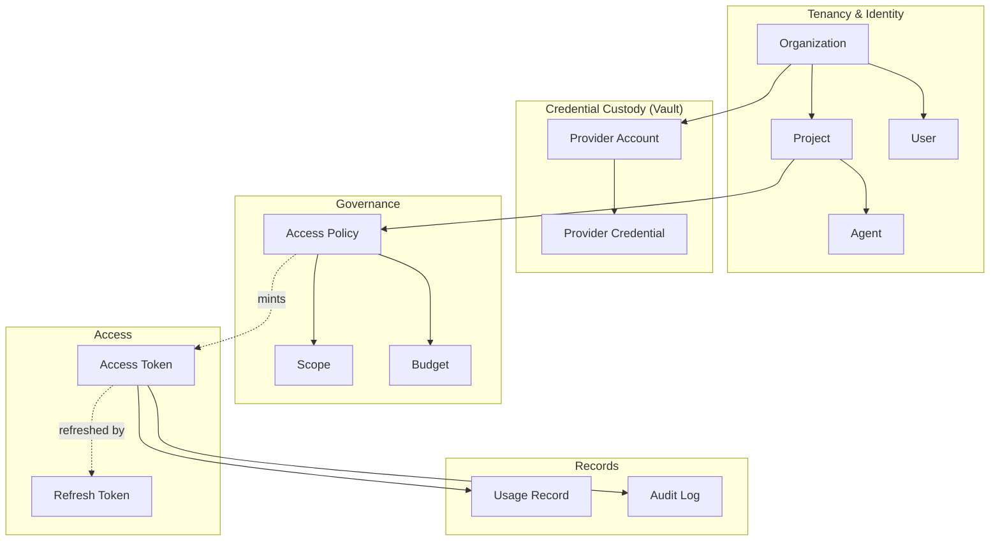
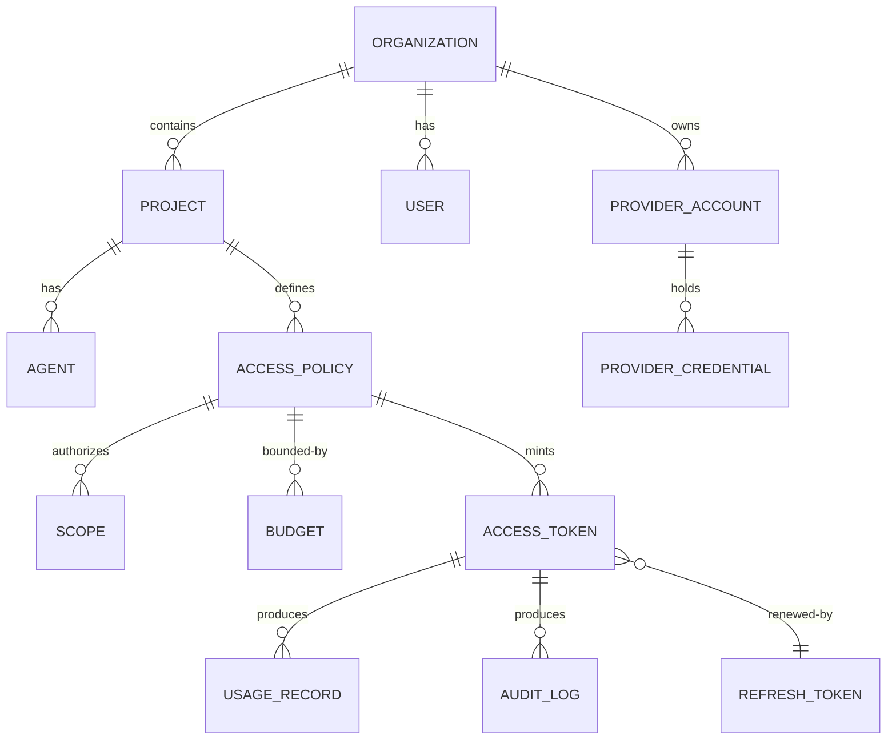

# ASKP — Core Concepts

**Status:** Draft · **Audience:** Anyone implementing, integrating, or evaluating ASKP

This document defines the **vocabulary and domain model** of ASKP. Every later document and
the protocol specification use these terms with these exact meanings. Where a term has special
meaning, it is **Capitalized**.

---

## 1. Mental model

ASKP separates **identity & tenancy** (who is asking) from **credentials** (the provider keys)
and brokers access between them through **tokens** governed by **policies and budgets**.



The flow: a **Project** has **Policies**; a Policy authorizes specific **Scopes** under a
**Budget**; ASKP mints an **Access Token** embodying that grant; the token is exchanged at the
Gateway for a **Provider Credential** stored against a **Provider Account**; every call produces
a **Usage Record** and an **Audit Log** entry.

---

## 2. Tenancy & identity

### Organization
The top-level tenant and the **isolation boundary**. All data — credentials, policies, tokens,
usage, audit — belongs to exactly one Organization and never crosses to another. An
Organization is who *owns* provider accounts and who *pays the bill*. Equivalent to a "tenant".

### Project
A subdivision of an Organization that groups related work (an app, a service, an environment
like `prod`/`staging`). Tokens, policies, and budgets are usually scoped to a Project. Projects
are how an Organization gets **attribution and cost allocation** ("which app spent what").

### User
A **human** identity within an Organization, authenticated to administer ASKP (store
credentials, define policies, view usage). Users have roles (e.g. owner, admin, developer,
viewer). Users generally do **not** make inference calls directly — they configure the system
that does. *(Full RBAC is detailed in Batch 2.)*

### Agent
A **non-human** identity (a service, autonomous agent, MCP server, CI job, or workload) that
actually consumes AI providers. Agents are **first-class principals** in ASKP — they
authenticate with their own credentials, are bound to a Project, and receive scoped tokens.
Agents are the primary subject of least-privilege design.

> **Principal** = any authenticated identity that can be granted access: a User or an Agent.

---

## 3. Credential custody

### Provider
An external AI provider ASKP can broker access to: OpenAI, Anthropic (Phase 1); Gemini, Groq,
OpenRouter, Azure OpenAI, Bedrock, Ollama (future). Each Provider is integrated via a
**Provider Adapter** (Batch 4) that knows its endpoints, auth, model catalog, and cost model.

### Provider Account
An Organization's *account with* a Provider — e.g. "Acme's OpenAI org". It groups one or more
Provider Credentials and carries provider-level configuration (base URL, provider-side org id).
One Organization may hold several Provider Accounts (e.g. separate OpenAI accounts for `prod`
and `dev`).

### Provider Credential
The **actual secret** — the raw provider API key (e.g. an `sk-...`) — belonging to a Provider
Account. ASKP's central security invariant governs it:

> **A Provider Credential is stored encrypted, is decrypted only inside the Vault/Gateway
> trust boundary at the moment of forwarding a request, and is NEVER returned to any client.**

Credentials are written and rotated by Users; they are never read back out. The plaintext key
crosses the trust boundary only on the leg from Gateway → Provider.

---

## 4. Governance

### Scope
A single, fine-grained permission string in ASKP's **hierarchical, colon-delimited grammar**:

```
provider:<name>:model:<model>:<capability>
```

Examples:

| Scope | Grants |
|---|---|
| `provider:openai:model:gpt-4o:chat.completions` | Chat completions on `gpt-4o` via OpenAI |
| `provider:anthropic:model:claude-sonnet-4-6:messages` | Messages API on a specific Claude model |
| `provider:openai:model:gpt-4o-mini:*` | Any capability on `gpt-4o-mini` |
| `provider:anthropic:model:*:messages` | Messages on any Anthropic model |

Scopes default to **least privilege**: absence of a Scope means "denied". Wildcards (`*`) are
supported at the model and capability segments. *(Formal grammar lives in the protocol spec;
full scope catalog in Batch 2.)*

### Access Policy
A named rule set, attached to a Project (or Organization), that declares **which Scopes a
Principal may hold** and under **which Budget and rate limits**. Policies are the source of
truth the Issuer consults when minting a token and the Gateway consults when authorizing a
request. A Policy answers: *"May this principal use this provider/model/capability, right now,
within budget?"*

### Budget
A spend ceiling enforced over a window. ASKP supports at least **daily** and **monthly**
budgets, applied at token, Project, and/or Organization level. Budgets are evaluated against
accumulated cost from Usage Records. A request that would exceed an applicable Budget is
**rejected before it reaches the provider**. Budgets are how a runaway agent or leaked token
cannot cause unbounded spend.

### Rate Limit
A request-frequency ceiling (e.g. requests/minute), enforceable **per token, per Project, and
per Organization**, independent of cost. Protects against abuse and overload.

---

## 5. Access

### Access Token
The credential an application/agent presents to the Gateway. Per the locked token model, it is
a **short-lived (~10 min), signed JWT** carrying its tenancy (org, project), subject
(principal), granted Scopes, budget references, and a unique token id (`jti`). It is
**self-describing** (the Gateway can read its grant without a DB lookup) yet **instantly
revocable** (see Revocation). The Access Token references Provider Credentials it can never
read. ASKP tokens are prefixed (e.g. `askp_at_…`) for easy detection in logs and secret scanners.

### Refresh Token
A long-lived, **opaque** (non-self-describing) credential, stored server-side, used to mint
fresh Access Tokens without re-running full authentication. Refresh Tokens can themselves be
revoked, which severs a principal's ability to obtain new Access Tokens.

### Revocation
The act of invalidating a token before its natural expiry. ASKP combines short token lifetimes
with a **revocation list** (a Redis-backed denylist keyed by `jti` / token-family): the Gateway
checks it on every request, so revocation takes effect on **the very next call** — without
rotating any Provider Credential or redeploying anything. This is the answer to "instant
revocation".

---

## 6. Records

### Usage Record
A per-request fact capturing what was consumed: timestamp, org, project, principal, token
`jti`, provider, model, capability, request/response token counts, and **computed cost**.
Usage Records feed Budgets, cost dashboards, and billing/attribution.

### Audit Log
An append-only record of **security- and governance-relevant events**: token issued, token
revoked, credential stored/rotated, policy changed, request authorized/denied, budget exceeded.
Audit Logs answer "who did what, when, and was it allowed". Distinct from Usage Records (which
answer "what was consumed and what did it cost").

---

## 7. The system components (named here, designed in Architecture)

These are the runtime pieces that operate on the concepts above. Defined fully in
[System Architecture](../architecture/system-architecture.md):

| Component | Responsibility |
|---|---|
| **Issuer** (Authorization Server) | Authenticates principals; evaluates Policy; mints Access & Refresh Tokens. |
| **Vault** | Stores and encrypts Provider Credentials; brokers decryption inside the trust boundary. |
| **Gateway** (Resource Server) | Validates tokens, enforces Policy/Budget/Rate Limit, swaps token→credential, proxies to the Provider, emits Usage + Audit. |
| **Policy Engine** | Evaluates Scopes, Budgets, and rules for the Issuer and Gateway. |
| **Admin API** | CRUD for Organizations, Projects, Users, Agents, Provider Accounts, Policies, Budgets. |

---

## 8. Relationships at a glance



> This is a conceptual model, not the physical schema. The normative database design and full
> ER diagram are produced in Batch 3.

---

## 9. One-paragraph summary

An **Organization** (the tenant) owns **Provider Accounts** holding encrypted **Provider
Credentials**. Within the Organization, **Projects** host **Users** (humans) and **Agents**
(workloads). **Access Policies** declare which **Scopes** a principal may hold under which
**Budgets** and rate limits. The **Issuer** mints short-lived, scoped **Access Tokens** (and
opaque **Refresh Tokens**). The **Gateway** validates each token, enforces policy and budget,
swaps the token for the real **Provider Credential** without ever exposing it, proxies the call
to the **Provider**, and emits a **Usage Record** and **Audit Log** entry. Any token can be
**revoked** instantly. That is ASKP.

---

*Next: [ASKP Protocol Specification](../../spec/askp-protocol-v1.md) — these concepts made normative.*
