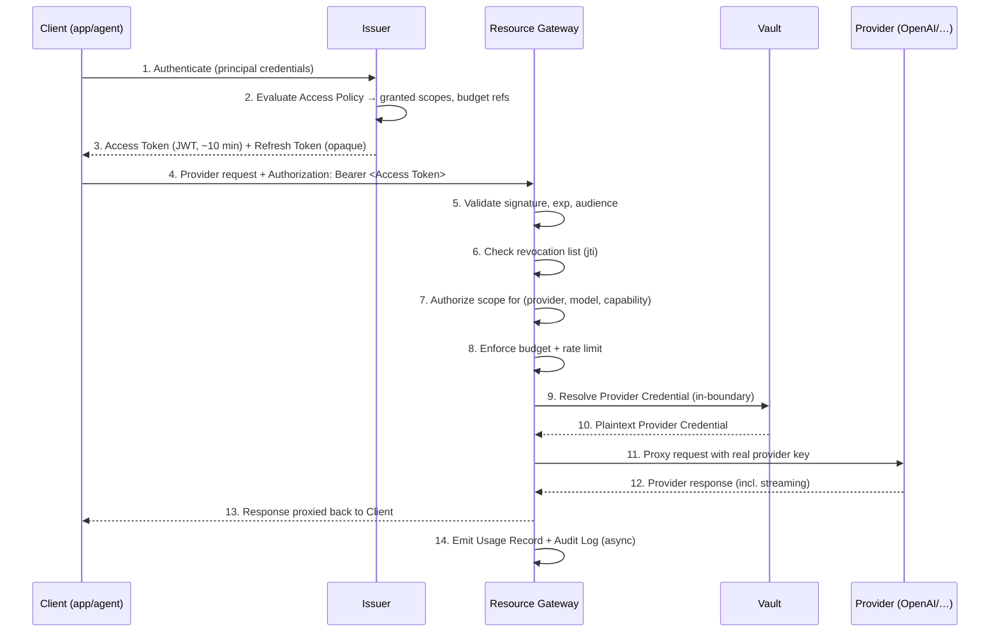

# ASKP Protocol Specification — Version 1 (Draft)

```
Protocol:        AI Secure Key Protocol (ASKP)
Version:         askp/v1
Document:        draft-01
Status:          Working Draft (PRE-STABLE — subject to change)
Author:          Umesh Kedimi
Updated:         2026-06-18
```

> **This is the normative specification.** It is language-agnostic. The Python reference
> implementation in `services/` MUST conform to this document; this document does not depend on
> it. If something cannot be reimplemented from this text alone, it does not belong here.

---

## 1. Introduction

ASKP defines a protocol for **delegated, least-privilege access to AI providers** without
exposing raw provider credentials to clients. It is modeled on the role separation of OAuth 2.0
(RFC 6749) and adapted to AI infrastructure: provider/model/capability scoping, token-cost
budgets, usage attribution, and instant revocation.

This draft (`draft-01`) specifies the foundational model: roles, the access token format, the
scope grammar, the core endpoints, error semantics, and revocation. Detailed schemas
(database, full OpenAPI, per-provider adapter contracts) are layered in companion documents but
do not alter the normative rules below.

### 1.1 Requirements language

The key words **MUST**, **MUST NOT**, **REQUIRED**, **SHALL**, **SHALL NOT**, **SHOULD**,
**SHOULD NOT**, **RECOMMENDED**, **MAY**, and **OPTIONAL** in this document are to be
interpreted as described in **RFC 2119** and **RFC 8174** when, and only when, they appear in
all capitals.

### 1.2 Conformance

An implementation is **ASKP-`v1`-conformant** if it implements all **MUST**/**MUST NOT**
requirements in §§3–9 for at least one Provider. An implementation MAY support additional
endpoints, scopes, and providers without losing conformance, provided it does not violate any
**MUST**/**MUST NOT**.

---

## 2. Terminology

The terms below are normative. Their conceptual background is in
[`docs/concepts/core-concepts.md`](../docs/concepts/core-concepts.md).

| Term | Definition |
|---|---|
| **Principal** | An authenticated identity that can be granted access: a **User** (human) or an **Agent** (workload). |
| **Organization** | The top-level tenant and isolation boundary. |
| **Project** | A subdivision of an Organization for grouping and attribution. |
| **Provider** | An external AI service (e.g. OpenAI, Anthropic) ASKP brokers access to. |
| **Provider Credential** | The raw secret authenticating ASKP to a Provider. MUST NOT be exposed to clients. |
| **Scope** | A single fine-grained permission string (§5). |
| **Access Policy** | The rule set declaring which Scopes a Principal may hold, under which Budget and limits. |
| **Budget** | A spend ceiling over a time window. |
| **Access Token** | The short-lived, scoped credential a Client presents to the Resource Gateway (§4). |
| **Refresh Token** | A long-lived opaque credential used to obtain new Access Tokens (§7). |

### 2.1 Protocol roles

ASKP defines five roles. A single deployment MAY co-locate several roles in one process; the
protocol treats them as logically distinct.

| Role | Analogous OAuth role | Responsibility |
|---|---|---|
| **Client** | Client | The application/agent that holds an Access Token and calls a Provider through ASKP. |
| **Issuer** | Authorization Server | Authenticates Principals, evaluates Access Policy, issues Access and Refresh Tokens. |
| **Resource Gateway** | Resource Server | Validates Access Tokens, enforces policy/budget/limits, exchanges token for Provider Credential, proxies to Provider. |
| **Vault** | (Vault-like) | Stores Provider Credentials encrypted; releases plaintext only inside the trust boundary. |
| **Provider** | Protected Resource | The upstream AI service that ultimately serves the request. |

---

## 3. Protocol overview

### 3.1 The exchange



### 3.2 Core invariants

A conformant implementation MUST uphold all of the following:

- **INV-1 (Credential confidentiality).** A Provider Credential MUST NOT be transmitted to,
  derivable by, or readable by any Client. It crosses the trust boundary only on the
  Gateway→Provider leg (step 11).
- **INV-2 (No implicit access).** A request MUST be denied unless an Access Token explicitly
  carries a Scope authorizing the requested `(provider, model, capability)`.
- **INV-3 (Pre-flight enforcement).** Policy, budget, and rate-limit checks MUST occur
  **before** the request is forwarded to the Provider (steps 7–8 before step 11).
- **INV-4 (Tenancy isolation).** A token issued for Organization `O` MUST NOT grant access to
  any Provider Credential, Policy, or data of any other Organization.
- **INV-5 (Instant revocation).** A revoked Access Token MUST be rejected on the next request
  it is presented in, independent of its `exp`.
- **INV-6 (Attribution).** Every forwarded request MUST be recorded with its org, project,
  principal, and token `jti`.

---

## 4. Access Token

### 4.1 Format

An ASKP `v1` Access Token **MUST** be a JSON Web Token (**RFC 7519**) signed as a JWS
(**RFC 7515**). Implementations:

- **MUST** support `EdDSA` (Ed25519) or `RS256` for signing. They **SHOULD** prefer `EdDSA`.
- **MUST NOT** accept tokens with `alg: none`.
- **MUST** validate the signature, `exp`, `nbf` (if present), `iss`, and `aud` on every request.

When serialized for transport (e.g. as a bearer string or provider API key), an Access Token
**SHOULD** be prefixed with `askp_at_` to aid detection in logs and secret scanners. The prefix
is transport metadata and is not part of the JWS.

### 4.2 Claims

| Claim | Req. | Description |
|---|---|---|
| `iss` | MUST | Issuer identifier (URL of the Issuer). |
| `aud` | MUST | Intended Resource Gateway audience. |
| `sub` | MUST | Principal identifier (`user:<id>` or `agent:<id>`). |
| `exp` | MUST | Expiry. Implementations SHOULD issue with a lifetime ≤ 15 minutes. |
| `iat` | MUST | Issued-at time. |
| `jti` | MUST | Unique token ID; the key used for revocation. |
| `org` | MUST | Organization (tenant) identifier. |
| `proj` | MUST | Project identifier. |
| `scopes` | MUST | Array of granted Scope strings (§5). |
| `nbf` | MAY | Not-before time. |
| `bud` | SHOULD | Budget reference(s) the Gateway evaluates at request time. |
| `tf` | MAY | Token-family ID, enabling family-wide revocation (§7.3). |
| `cnf` | MAY | Confirmation claim for sender-constrained tokens (future; e.g. mTLS/DPoP). |

The `scopes` claim carries the **granted** scopes, which MUST be a subset of what the Principal's
Access Policy authorizes at issuance time. The Gateway is the final authority and re-checks
policy at request time (§6.4).

### 4.3 Example (decoded payload)

```json
{
  "iss": "https://askp.acme.com",
  "aud": "https://askp.acme.com/gateway",
  "sub": "agent:6f2c…",
  "org": "org_acme",
  "proj": "proj_chatbot_prod",
  "scopes": [
    "provider:openai:model:gpt-4o-mini:chat.completions",
    "provider:anthropic:model:claude-sonnet-4-6:messages"
  ],
  "bud": ["budget:proj_chatbot_prod:daily"],
  "jti": "at_01J…",
  "tf":  "tf_01J…",
  "iat": 1718700000,
  "exp": 1718700600
}
```

### 4.4 Token model rationale (non-normative)

ASKP deliberately combines a **self-describing JWT** (so the Gateway authorizes without a
database round-trip on the hot path) with a **short lifetime + revocation list** (so revocation
is instant despite statelessness). A pure-stateless JWT cannot satisfy INV-5; a purely opaque
token forces a store lookup that becomes the hot path. The hybrid is the industry-proven answer
and is normative for `v1` in spirit (MUSTs above), while leaving signing-algorithm and
revocation-store *implementation* open.

---

## 5. Scope grammar

### 5.1 Syntax

A Scope is an ASCII string of colon-delimited segments:

```
scope        = "provider:" provider ":model:" model ":" capability
provider     = token            ; e.g. "openai", "anthropic"
model        = token / "*"      ; e.g. "gpt-4o", "claude-sonnet-4-6", "*"
capability   = captoken / "*"   ; e.g. "chat.completions", "messages", "embeddings", "*"
token        = 1*( ALPHA / DIGIT / "-" / "_" / "." )
captoken     = 1*( ALPHA / DIGIT / "-" / "_" / "." )
```

- The `provider` segment **MUST NOT** be a wildcard in `v1` (a token is always bound to explicit providers).
- The `model` and `capability` segments **MAY** be the wildcard `*`, meaning "any value at this segment".
- Scope comparison is **case-sensitive** and **exact per segment**, except where a stored scope's segment is `*`.

### 5.2 Matching

A requested operation is described by a triple `(provider, model, capability)`. A granted Scope
**authorizes** that operation if and only if, segment by segment, the granted segment equals the
requested segment **or** the granted segment is `*` (for `model`/`capability`).

| Granted scope | Authorizes `(openai, gpt-4o, chat.completions)`? |
|---|---|
| `provider:openai:model:gpt-4o:chat.completions` | ✅ exact |
| `provider:openai:model:*:chat.completions` | ✅ model wildcard |
| `provider:openai:model:gpt-4o:*` | ✅ capability wildcard |
| `provider:openai:model:gpt-4o-mini:chat.completions` | ❌ model mismatch |
| `provider:anthropic:model:*:*` | ❌ provider mismatch |

### 5.3 Default deny

If **no** granted Scope authorizes the requested operation, the Gateway **MUST** deny the
request with `insufficient_scope` (§8). Absence of permission is denial.

### 5.4 Capability naming

Capability tokens are Provider-namespaced operation names. `v1` defines, at minimum:

| Provider | Capability | Maps to |
|---|---|---|
| `openai` | `chat.completions` | `POST /v1/chat/completions` |
| `openai` | `embeddings` | `POST /v1/embeddings` |
| `openai` | `responses` | `POST /v1/responses` |
| `anthropic` | `messages` | `POST /v1/messages` |

Additional capabilities and providers are added by Provider Adapters (Batch 4) without
changing this grammar.

---

## 6. Resource Gateway

### 6.1 Provider request routing

The Gateway **MUST** expose provider-native request shapes under a provider-scoped path so that
existing Provider SDKs work by changing only the base URL and the API key. The RECOMMENDED form:

```
{gateway_base}/v1/providers/{provider}/{provider_native_path}
```

Example: an OpenAI SDK configured with
`base_url = https://askp.acme.com/v1/providers/openai` will `POST` to
`https://askp.acme.com/v1/providers/openai/v1/chat/completions`.

> ASKP `v1` is a **transparent passthrough**: it does not rewrite the Provider's request or
> response body. Cross-provider request *normalization* is explicitly out of scope for `v1`.

### 6.2 Authentication of the request

The Client **MUST** present its Access Token to the Gateway as a bearer credential, either:

- in the `Authorization: Bearer <token>` header (RECOMMENDED), or
- where a Provider SDK only sends an API key, as that provider's key field carrying the
  `askp_at_…` token (compatibility mode).

### 6.3 Request validation pipeline (normative order)

For each request the Gateway **MUST**, in order, and **MUST** stop at the first failure:

1. **Parse & verify the JWS** — signature, `alg` allowed, not `none`.
2. **Verify standard claims** — `exp` not passed, `nbf`/`iat` sane, `iss` trusted, `aud` matches this Gateway.
3. **Check revocation** — look up `jti` (and `tf` if present) in the revocation list; reject if listed (§7.3).
4. **Resolve operation** — derive `(provider, model, capability)` from the path and request body.
5. **Authorize scope** — at least one `scopes` entry MUST authorize the operation (§5.2); else `insufficient_scope`.
6. **Re-check policy** — confirm the token's grant is still permitted by current Access Policy (tokens can be out-paced by policy changes).
7. **Enforce rate limit** — per token / project / org; reject with `rate_limited` if exceeded.
8. **Enforce budget** — if the applicable Budget is already exhausted, reject with `budget_exceeded` (§6.5).
9. **Resolve credential** — obtain the Provider Credential from the Vault, in-boundary (INV-1).
10. **Proxy** — forward to the Provider, streaming the response through unchanged where applicable.
11. **Record** — emit Usage Record and Audit Log entries (MAY be asynchronous, but MUST NOT be dropped silently).

Steps 1–8 are **pre-flight** and satisfy INV-2/INV-3. Only after all pass does the Provider
Credential get resolved (step 9).

### 6.4 Tenancy enforcement

The Gateway **MUST** resolve the Provider Credential strictly within the `org` named in the
token. A token **MUST NOT** be able to reach any other Organization's credential or data
(INV-4), regardless of scope contents.

### 6.5 Budget semantics

- Budgets are evaluated against accumulated cost derived from Usage Records over the budget
  window (e.g. daily/monthly).
- A request **MUST** be rejected pre-flight if the applicable Budget is already exhausted.
- Because a request's exact cost is known only after the Provider responds, implementations
  **MUST** account the realized cost to the Budget after the call (post-flight), and **MAY**
  additionally reserve an estimated cost pre-flight to reduce overshoot under concurrency.
- Over-budget rejection **MUST** produce an Audit Log entry.

### 6.6 Streaming

Where a Provider supports streaming (e.g. SSE), the Gateway **MUST** support proxying the
stream to the Client without buffering the entire response, and **MUST** still produce Usage
and Audit records once the stream completes or terminates.

---

## 7. Token issuance, refresh, and revocation

### 7.1 Issuance

The Issuer authenticates a Principal (mechanisms — API key, client credentials, OIDC
federation — are detailed in Batch 2), evaluates the applicable Access Policy, and returns an
Access Token (§4) and OPTIONALLY a Refresh Token. The granted `scopes` **MUST** be a subset of
what the Policy authorizes.

### 7.2 Refresh

A **Refresh Token** is a long-lived **opaque** credential (not a JWT), stored server-side by
the Issuer. Presenting a valid Refresh Token returns a new Access Token without full
re-authentication. Refresh Tokens:

- **MUST** be revocable independently.
- **SHOULD** be rotated on use (a new Refresh Token issued, the old one invalidated).
- When revoked, the associated token-family (`tf`) **SHOULD** be revoked (§7.3).

### 7.3 Revocation

ASKP achieves **instant revocation** (INV-5) via a **revocation list**:

- The Issuer/Admin API exposes a revocation operation that adds a token's `jti` — or an entire
  token-family `tf`, or all tokens for a `sub`/`proj`/`org` — to the revocation list.
- The Gateway **MUST** consult the revocation list at step 6.3-③ for every request.
- An entry **MAY** be evicted from the list once the corresponding token's `exp` has passed,
  since an expired token is rejected anyway (bounding the list's size by the token TTL).
- Revocation **MUST NOT** require rotating any Provider Credential or redeploying any Client.

### 7.4 Provider Credential lifecycle

- Provider Credentials are **written** and **rotated** through the Admin API.
- They **MUST** be stored encrypted at rest.
- They **MUST NOT** be readable back through any API (write/rotate only).
- Rotating a Provider Credential **MUST NOT** invalidate outstanding Access Tokens (tokens
  reference the credential indirectly), and a revoked Access Token **MUST NOT** require
  credential rotation. The two lifecycles are independent.

---

## 8. Errors

ASKP error responses **MUST** use a JSON body with a stable machine-readable `error` code, and
SHOULD include a human-readable `error_description`. HTTP status codes follow convention.

```json
{ "error": "insufficient_scope",
  "error_description": "Token does not authorize provider:openai:model:gpt-4o:chat.completions",
  "request_id": "req_01J…" }
```

| `error` | HTTP | Meaning |
|---|---|---|
| `invalid_token` | 401 | Missing, malformed, unverifiable, or expired Access Token. |
| `token_revoked` | 401 | Token is present on the revocation list. |
| `insufficient_scope` | 403 | No granted Scope authorizes the requested operation. |
| `policy_denied` | 403 | Operation rejected by current Access Policy. |
| `tenant_isolation` | 403 | Requested resource is outside the token's Organization. |
| `rate_limited` | 429 | Rate limit exceeded (token/project/org). |
| `budget_exceeded` | 429 | Applicable Budget exhausted. |
| `provider_error` | 502 | Upstream Provider returned an error (body MAY be passed through). |
| `provider_unavailable` | 503 | Provider unreachable or credential resolution failed. |

The `error` codes above are a **stable vocabulary**; implementations **MUST NOT** repurpose
them with different meanings. A 401 response **SHOULD** include a `WWW-Authenticate: Bearer`
header consistent with RFC 6750.

---

## 9. Security considerations

This is a summary; the full Security Model and Threat Model are Batch 2 deliverables.

- **S-1 Transport.** All ASKP traffic (Client↔Issuer, Client↔Gateway, Gateway↔Provider)
  **MUST** use TLS. Tokens are bearer credentials and **MUST NOT** traverse cleartext channels.
- **S-2 Short lifetimes.** Access Tokens **SHOULD** be short-lived (≤15 min) to bound exposure
  from leakage even before revocation propagates.
- **S-3 Least privilege.** Issued `scopes` **SHOULD** be the minimum the Principal needs;
  wildcards SHOULD be used sparingly and audited.
- **S-4 Credential confidentiality.** Per INV-1, Provider Credentials are never exposed to
  Clients and are decrypted only in-boundary at forward time.
- **S-5 Key management.** Issuer signing keys **MUST** be rotatable; the Gateway **MUST**
  support a published key set (e.g. JWKS) and key rollover without downtime.
- **S-6 Logging hygiene.** Implementations **MUST NOT** log Provider Credentials or full Access
  Tokens in plaintext; the `askp_at_` prefix aids scanners in catching accidental leaks.
- **S-7 Replay & binding.** `v1` uses bearer tokens; sender-constrained tokens (mTLS/DPoP via
  the `cnf` claim) are a planned hardening (future draft).
- **S-8 Audit integrity.** Audit Logs **SHOULD** be append-only and tamper-evident.

---

## 10. Versioning & evolution

- This protocol is versioned `askp/v1`. Backward-incompatible changes increment the major
  version (`askp/v2`).
- Within `v1`, drafts (`draft-01`, `draft-02`, …) refine wording and add OPTIONAL features
  without breaking conformant `v1` implementations.
- New Providers, Scopes, capabilities, and OPTIONAL claims are **non-breaking** and do not
  require a version bump.
- The error-code vocabulary (§8) and the core invariants (§3.2) are **stability commitments**:
  they will not change incompatibly within `v1`.

---

## Appendix A — Conformance checklist (informative)

An implementation targeting ASKP `v1` should verify:

- [ ] Access Tokens are signed JWTs; `alg: none` is rejected; signature/exp/iss/aud validated. (§4)
- [ ] Scope grammar parsed and matched per §5, with default-deny.
- [ ] Gateway runs the §6.3 pipeline in order and stops at first failure.
- [ ] Provider Credentials are never returned to clients and are encrypted at rest. (INV-1, §7.4)
- [ ] Revocation list is consulted per request; revocation is effective next request. (INV-5, §7.3)
- [ ] Tenancy isolation enforced on credential resolution. (INV-4, §6.4)
- [ ] Budgets and rate limits enforced pre-flight; realized cost accounted post-flight. (§6.5)
- [ ] Streaming responses proxied without full buffering; usage still recorded. (§6.6)
- [ ] Errors use the stable vocabulary of §8.
- [ ] All transport is TLS. (§9 S-1)

---

*This is a working draft. Issues and proposals against this spec are welcome once the repo opens for contribution.*
